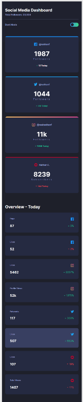

# Frontend Mentor - Social media dashboard with theme switcher solution

This is a solution to the [Social media dashboard with theme switcher challenge on Frontend Mentor](https://www.frontendmentor.io/challenges/social-media-dashboard-with-theme-switcher-6oY8ozp_H).

## Table of contents

- [Overview](#overview)
  - [The challenge](#the-challenge)
  - [Screenshot](#screenshot)
- [My process](#my-process)
  - [Built with](#built-with)
  - [What I learned](#what-i-learned)
  - [Continued development](#continued-development)
  - [Useful resources](#useful-resources)
- [Author](#author)

## Overview

- Social media dashboard with theme switcher

### The challenge

Users should be able to:

- View the optimal layout for the site depending on their device's screen size
- See hover states for all interactive elements on the page
- Toggle color theme to their preference

### Screenshot

## My process

- Working with CSS custome properties, it can be a litle bit tricky, but once it properly managed, it will dramatically save the
  time and ease the overwhelming when dealing with complicated styles and many repeatative styles.
- I have used javascript to dynamically generate the html cards for each section, this will make the project more scallable.

### Built with

- Semantic HTML5 markup
- CSS custom properties
- Flexbox
- Desktop-first workflow
- Javascript

### What I learned

- Improved my CSS skills especially working with consesntance styling using css custome properties.
  using javascript to dynamically generate html template for each section.

### Continued development

-IMPROVING MY CSS SKILLS, ADVANCED CSS CONCEPTS.
-USING JAVASCRIPT TO MANIPULATE THE DOM.

### Useful resources

- [Example resource 1](https://developer.mozilla.org/en-US/docs/Learn/JavaScript) - The Official Documentation site for Javascript and CSS, helps when need more information when working with JS or CSS.

## Author

#### DANIEL DENKHA

- Frontend Mentor - [@Korg01wfd](https://www.frontendmentor.io/profile/Korg01wfd)
